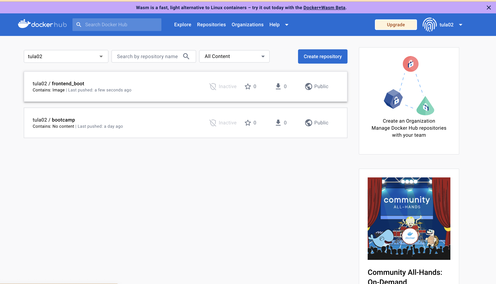
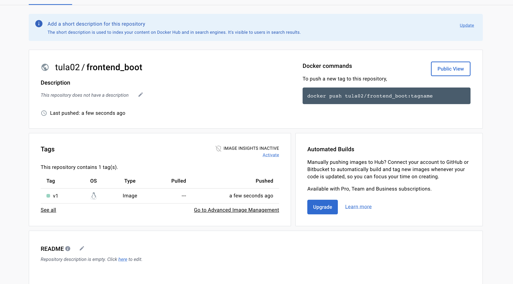
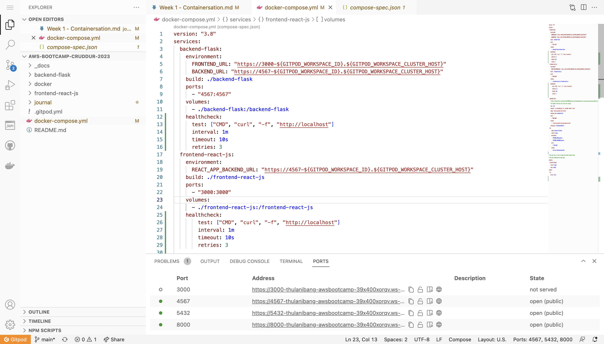
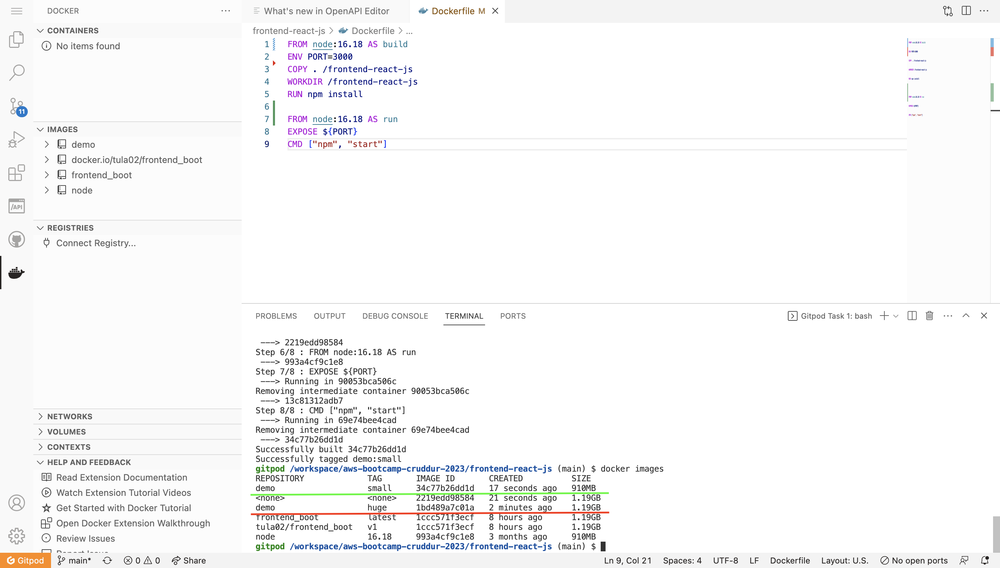
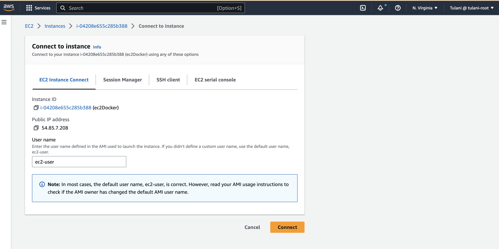
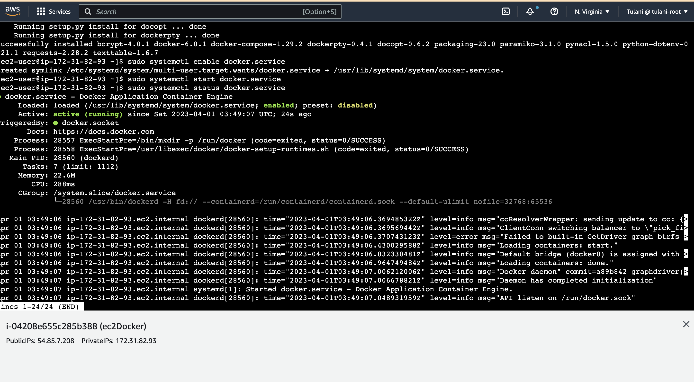
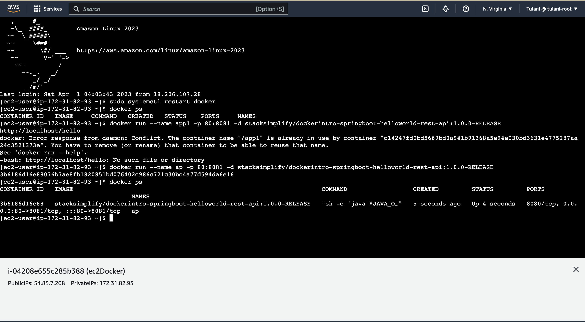

#Journal for Week 1 - Containersation
## The following is the required homework:
 
 ### Push and tag a image to DockerHub

Here I built an image using the dockerfile for the frontend, tagged it and pushed it. The following is a step by step process of how that was carried out:
Go to frontend-react-js direcory
```
  cd frontend-react-js
```
Build docker image
```
 docker build --pull --rm -f "frontend-react-js/Dockerfile" -t frontend_boot:latest "frontend-react-js"
 ```
 
tag docker image
 ```
 docker tag frontend_boot tula02/frontend_boot:v1
 ```

Push docker image
```
docker push tula02/frontend_boot:v1
```


### Implementing a Health check in the docker composer file
Health checks are meant to chek if resources are healthy. Here health checks are implemented in the docker compose file.
The health checks are implemented on each container service.


### Multi-stage building for a Dockerfile build

Here i built a multi-stage for a docker build. The highlighted underlined parts show the images built normally and the one using multi-stage build. The underlined red is the originally built and the green is the multi-stage built, which shows it's advantages of speed and less space consumption. The steps to build the images are 
```
docker build -t demo:small .
```


### Docker container security best practices
  > Container first strategy
  > Container security components
  >Dockerhost and host configuration
  Security best Practices
  Keep host & docker updated to latest security patches
  Docker daemon and containers should run in non-root user mode
  Image vulnerability scanning
  Trusting a private vs public image registry
  No sensitive data in docker files or images
  Use secret management services to share secrets
  Read only file system and volume for docker
  Separate database for long term use
  Use Devsecops practices while building security
  Ensure all code is tested for vulnerabilities before production use


### Launching EC2 instance and pulling a container to it

Launching an eC2 instance  through the aws console using an admin account. 


After launching the ec2 instance, I went to the ec2 instance and connected to the ec2 instance connect. this is to have access to terminal through the browser



I the followed the follwoing cmds from  (https://www.cyberciti.biz/faq/how-to-install-docker-on-amazon-linux-2/) to successfully install docker on my ec2 instance.
The steps are for installing docker on my ec2 instance:
Checking pending updates
```
sudo yum update
```
Install docker
 ```
sudo yum install docker
```
Add group membership for default ec2-user so this can run all docker commands without sudo command
 ```
sudo yum install docker
```
enable docker service at AMI boot time
````
sudo systemctl enable docker.service

````

Start docker service

````
sudo systemctl start docker.service

````

Get docker service status on AMI instance

````
sudo systemctl status docker.service

````


The second phase of the task involved pulling docker image and running it. Here are the folleing steps to that:

Pull image 

````
docker pull stacksimplify/dockerintro-springboot-helloworld-rest-api:1.0.0-RELEASE

````
Checking image is pulled
````
docker images
````
running the docker image and accessing app
````
docker run --name ap -p 80:8081 -d stacksimplify/dockerintro-springboot-helloworld-rest-api:1.0.0-RELEASE
http://localhost/hello
````
list running container
````
docker ps
````

